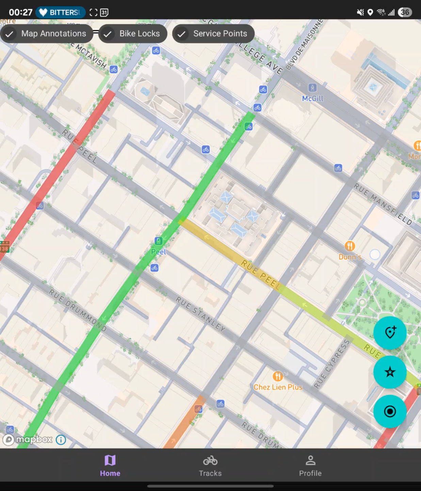

# WayBiker

WayBiker makes biking more accessible and safer by using community ratings of city streets.

## Street safety map

Users can see a color-coded map of community ratings, where red is very dangerous and green is very safe.

## Rating streets

Any user of the app can rate streets, which affects the map by giving more importance to newer ratings.

